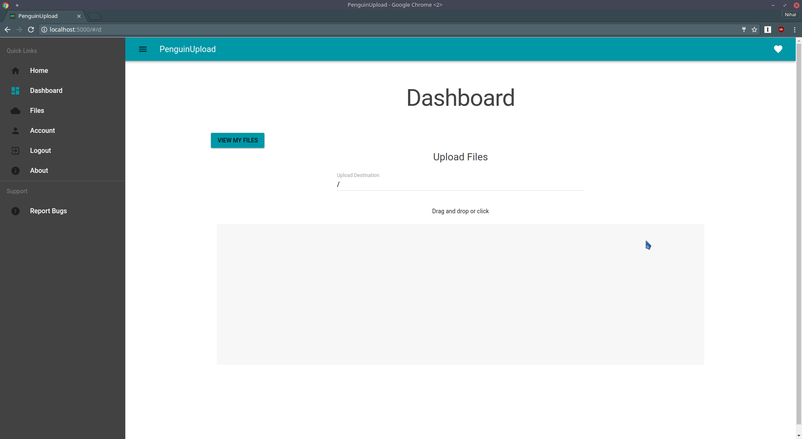

# PenguinUpload

A self-hostable, fully featured file host

## About

PenguinUpload is a self-hostable web application that
lets users upload and share files.

PenguinUpload was inspired by [sr.ht](https://gogs.sr.ht/SirCmpwn/sr.ht).
However, while `sr.ht` uses a Flask backend and static HTML as a frontend,
PenguinUpload uses an ASP.NET Core + NancyFx backend and a Vue.js SPA with
Vue Material as a frontend.

## Features/Details

- Easy configuration (just a JSON file!)
  - Disable public registration
    - Require an invite code to create an account
  - Set physical location of files (use `/tmp` for ephemeral storage)
- Simple directory structure and file metadata
  - A simple directory structure to organize files is available (>= **0.8.x**)
  - Directory structure is generated dynamically on query
  - File metadata includes size and upload date
- Password protection of files
  - Server enforced password protection
  - Passwords are hashed and stored securely
- Complete API with stateless authentication for accessing the entire application
  - All functionality is exposed through the API
  - In fact, the entire web application (a Vue.js SPA) works entirely
    through calls to PenguinUpload's REST API
  - Each user has an API key
- Intuitive Material Design interface
  - Pages for login, upload, download, profile, file management, and more
- Concurrent, streamed file transfer
  - Multiple uploads/downloads at a time
- Uploaded file management
  - Download previously uploaded files
  - Protect uploaded files with custom passwords
  - Share download links, even to password protected files, which will
    prompt for the password. Links can also be generated containing encoded
    passwords.
- Advanced user management
  - User privileges, advanced admin API
  - File storage quotas and enforcement
- Optional resource usage control
  - Limit concurrent uploads per user

## Install

PenguinUpload uses an embedded NoSQL database ([LiteDB](https://github.com/mbdavid/LiteDB))
to store metadata about files and users. The files themselves are stored in a configurable
location on the filesystem.

### Setup Instructions (From source)

1. Install dependencies (.NET Core SDK 1.1, NPM/Node.js v7)
1. Run the included script `./build.sh`. It will output the application to `./PenguinUpload/src/PenguinUpload/bin/Release/netcoreapp1.0/publish/`,
  and you can copy it to wherever you like
1. Set up configuration - Create a file called `penguinupload.config.json`.
 See the [example configuration file](PenguinUpload/src/PenguinUpload/penguinupload.config.example.json) (`penguinupload.config.example.json` for an example.)
 This is required, as registration is disabled by default for security reasons.
1. (optional) Set ASP.NET Core config in a `hosting.json` file.

### Administration

See the [Administration documentation](docs/admin.md)

## License

Copyright &copy; 2017 0xFireball (Nihal Talur). All Rights Reserved.

Licensed under the Apache License 2.0
